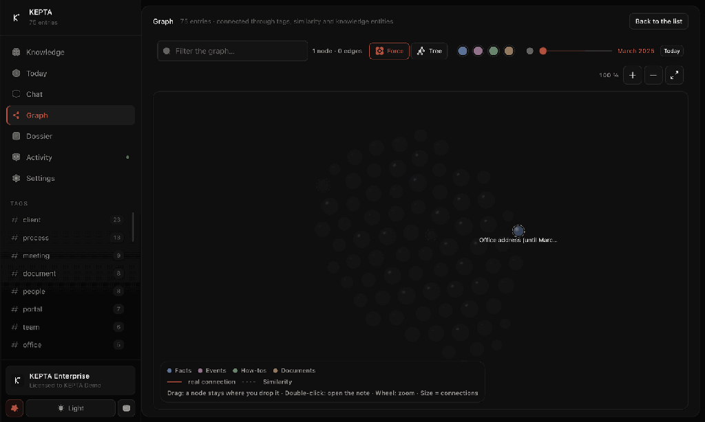
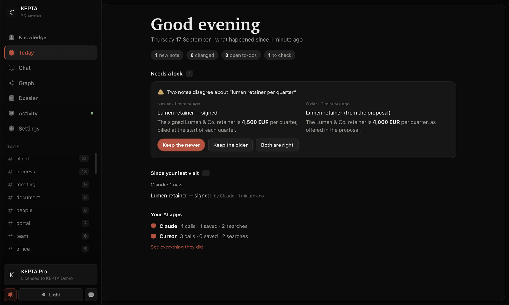
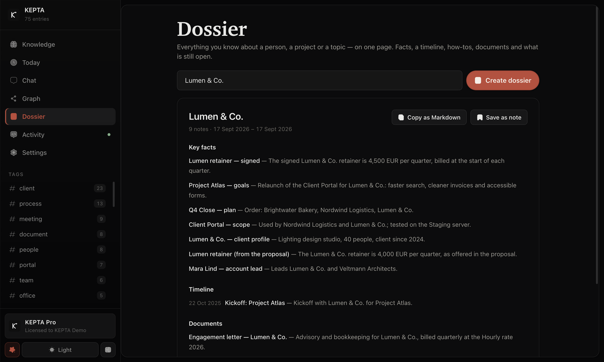
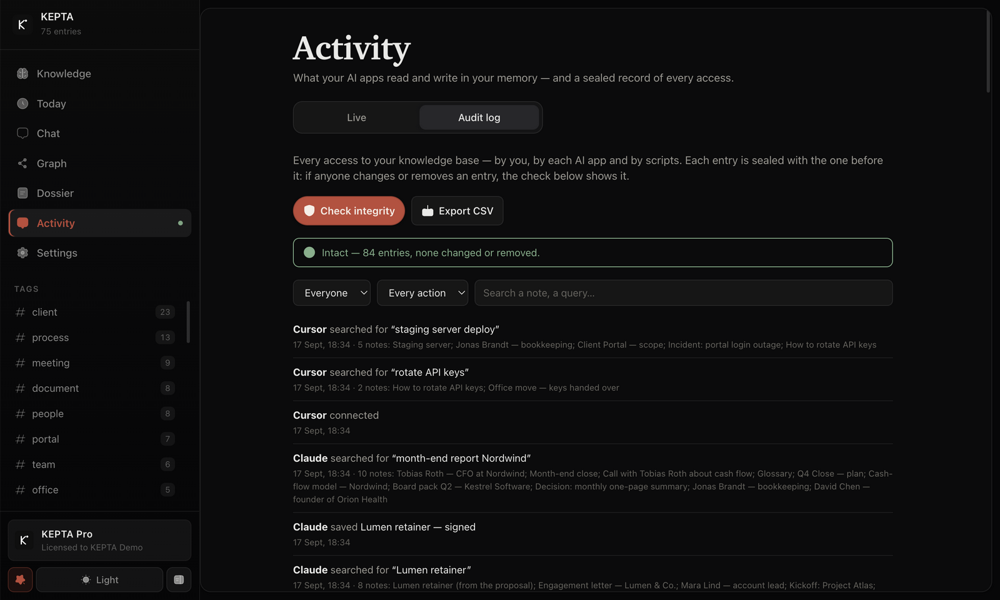
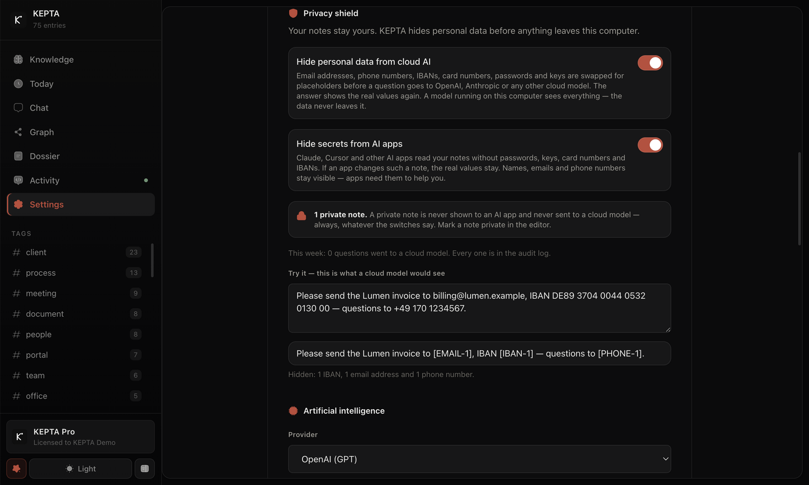
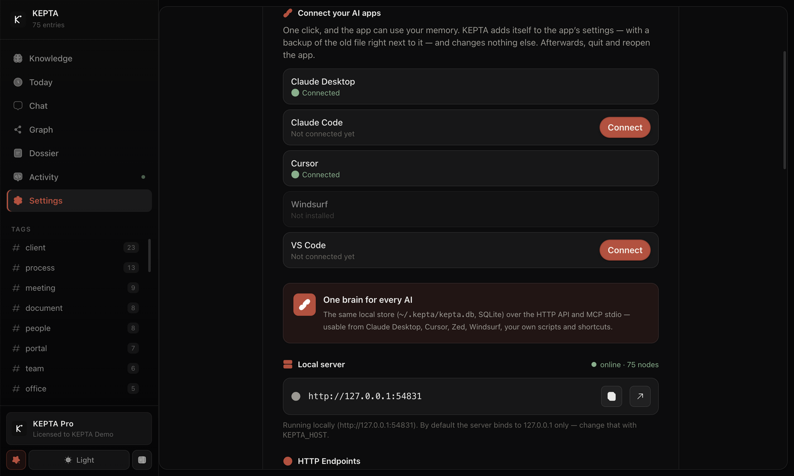
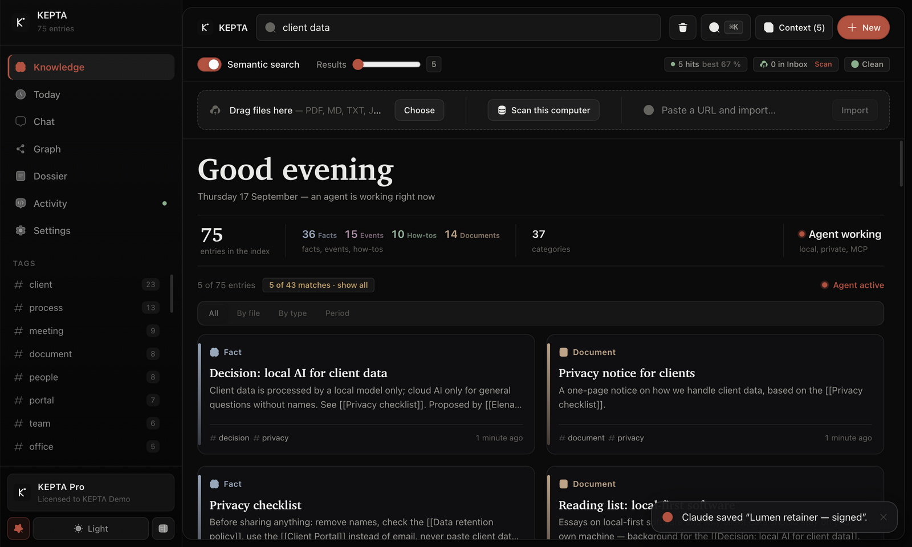
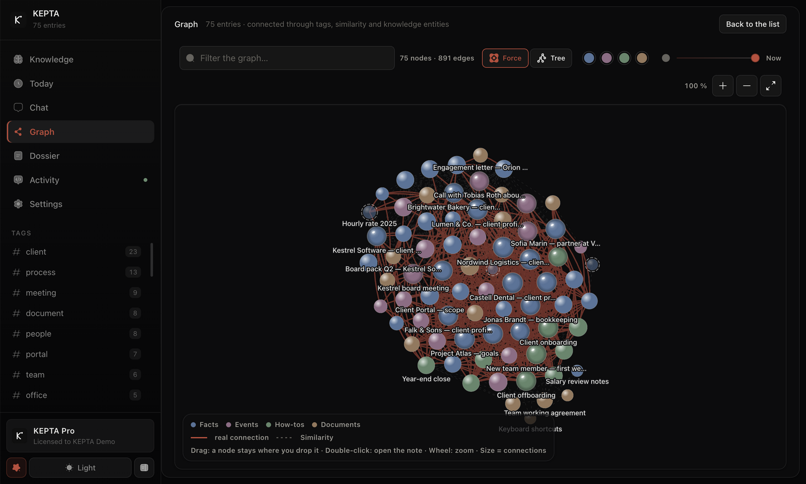
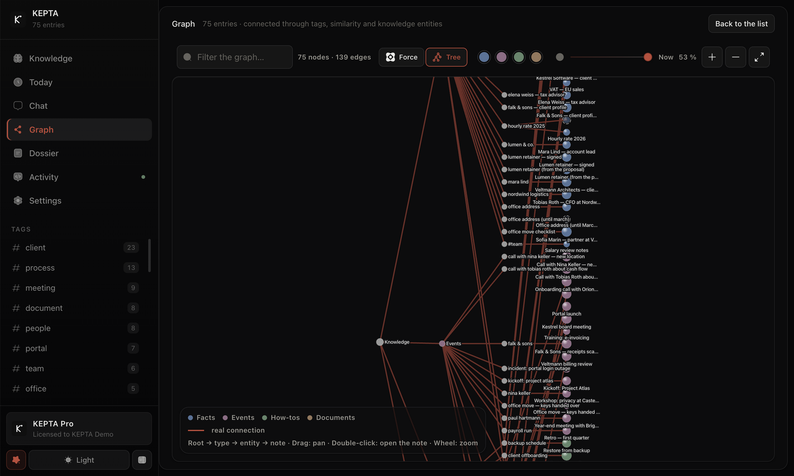
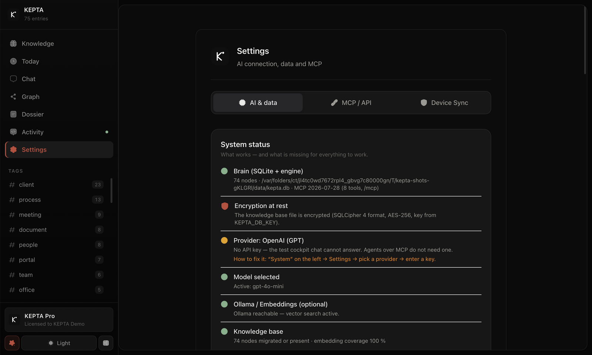

<p align="center"></p>
<h1 align="center">KEPTA Pro</h1>
<p align="center"><strong>Your AI forgets you after every chat.<br>KEPTA remembers — on your own computer, in one encrypted file.</strong></p>

<p align="center"><sub>The desktop app for your AI's memory · local · encrypted at rest · no cloud · no account · no telemetry</sub></p>

<p align="center">
  <a href="https://github.com/DamianTodorovic/kepta-enterprise-releases/releases/latest"></a>
  
  
  
  <a href="https://github.com/DamianTodorovic/kepta"></a>
</p>

<p align="center">
  <a href="https://github.com/DamianTodorovic/kepta-enterprise-releases/releases/latest"><b>⬇️ Download for Mac &amp; Windows</b></a> &nbsp;·&nbsp;
  <a href="#-get-kepta"><b>🔑 Get a license</b></a> &nbsp;·&nbsp;
  <a href="README.de.md"><b>🇩🇪 Deutsch</b></a>
</p>

<p align="center"></p>

---

## 😩 You know this

You explain your project to ChatGPT or Claude. Your client. The decision you made last week and why. The way you like things done.

The next day you open a new chat — and it knows none of it. So you explain it again. And again. Every assistant, every chat, every day.

## ✨ With KEPTA, it just knows

- **You tell Claude your client bills quarterly.** Two weeks later, in a brand-new chat, you ask about the invoice — and it already knows.
- **You drop a PDF into a folder.** Your assistant quotes from it.
- **You move house.** The new address replaces the old one, and the old one stops coming back — kept as history, never served as the truth.
- **You wonder what you knew in March.** Pull the time slider back and your knowledge graph shows exactly that day.
- **You switch from Claude to Cursor.** Same memory. What one assistant learns, the next one already knows.

You never brief it. There is one file on your computer; your assistants read it and write into it while you work — by themselves.

## 👀 See it

| Today — what changed since your last visit, and what needs a look | Activity — which AI app reads and writes what, live |
|---|---|
|  |  |
| **Dossier — everything about a client on one page** | **Audit log — every access, sealed and checkable** |
|  |  |
| **Privacy shield — what a cloud AI would get to see** | **Connect your AI apps in one click** |
|  |  |
| **Everything you know, grouped by kind — private notes included** | **Search that ranks by meaning** |
|  |  |
| **The knowledge graph — every note a node, every link an edge** | **The same knowledge as a tree** |
|  |  |
| **The editor — kinds of knowledge, `[[links]]`, one switch for private** | **Settings — system status and encryption at rest** |
|  |  |

<sub>KEPTA Pro 2.13 on an invented demo corpus — every name and every entry was made up for these shots. Claude and Cursor worked on it through the real MCP server.</sub>

## 💎 Why it feels different

| | |
|---|---|
| 🧠 **One brain for every AI** | Claude Desktop, Cursor and any other MCP client share the same memory. The MCP server ships inside the app — no Node.js, no npm, one block to paste. |
| 🕰️ **Knowledge that has a date** | Every memory carries a validity window and a confidence. A new fact supersedes the old one; expired facts are marked instead of being served as current. |
| 🔍 **Search that finds what you mean** | Full text, meaning (vectors) and the knowledge graph in one ranking. The best hit is on top — for you and for your agents, through the very same code. |
| 🕸️ **You can see what you know** | An interactive knowledge graph in two views, Force and Tree, with a time slider. It stays fluid at 3 000 notes and 9 500 connections, at 60 fps. |
| 📥 **Everything goes in, effortlessly** | Drag in PDFs and documents, clip web pages, watch an inbox folder, import an Obsidian vault — or let KEPTA find the documents already on your computer, with a preview first. |
| 🔒 **Yours, and only yours** | One encrypted file on your disk. The key lives in your system's keychain — the macOS Keychain, on Windows protected by DPAPI and bound to your account. No account, no telemetry, no cloud — KEPTA never phones home, not even to check the license. |

## 🧩 Everything KEPTA Pro does

<details open>
<summary><strong>🔒 Security &amp; privacy</strong></summary>

- **Encrypted at rest** — SQLCipher 4 format: AES-256 and an HMAC-SHA512 over every page, the write-ahead log included. Whoever holds only the file holds nothing readable
- **The key is created and kept in your OS keychain** automatically — no password to type, and your agents never see it
- **Recovery key in one click** (*Settings → System status*), ready for your password manager
- **Your settings live inside the encrypted file** — the key for your AI provider included
- **Nothing leaves your machine** unless you choose a cloud AI in the chat: the app listens on `127.0.0.1` only, with no account and no telemetry
- **Privacy shield** — email addresses, phone numbers, IBANs, card numbers, passwords and keys become placeholders before a question goes to a cloud model; the answer shows the real values again. AI apps read your notes without secrets. On by default, with a live preview in Settings
- **Private notes** — one switch in the editor, and that note is never shown to an AI app or sent to a cloud model
- **Audit log** — every access to your knowledge, by you, by each AI app and by scripts; every entry is sealed with the SHA-256 of the one before, and *Check integrity* shows whether anything was changed or removed. Export as CSV
- **Hardened desktop shell** — no Node in the window, sandbox on, a strict Content Security Policy
- Rate limiting, Helmet and input validation on every route
- **Your data is never a hostage:** without a valid license the window stays locked — never the data. The file stays on disk, encrypted, and readable by the [open core](https://github.com/DamianTodorovic/kepta)

</details>

<details open>
<summary><strong>📝 Notes</strong></summary>

- Create, edit and delete — **a real trash with restore**, never a hard delete
- **Four kinds of knowledge** — fact, event, how-to, document — assigned by readable rules that state their reason
- **Sort existing notes by kind afterwards**, with a preview before anything changes
- Tags, a confidence from 0 to 1, and **automatically extracted entities**
- **Scopes** — user, agent, session — so every memory knows whom it belongs to
- **Validity windows** — expired notes are marked, never quietly hidden
- **Supersede chains** — a new fact displaces the old one, and the history stays

</details>

<details open>
<summary><strong>📥 Capture &amp; import</strong></summary>

- **Drag &amp; drop files** — PDF (with the character maps of embedded fonts, so forms read as letters), Markdown, text and JSON, split into readable parts
- **Inbox folder**, watched and imported automatically
- **Obsidian vault import** — frontmatter kept, `[[wiki links]]` become graph edges
- **URL clipper** — protected against requests to your local network, strips navigation lines and cookie banners
- **Scan this computer** — opt-in, preview first; keys, credentials, browser profiles, keychains and wallets always stay blocked
- **Auto-learn** — save the key point of a chat answer as a note (off by default)
- **Re-read files** imported with an older extraction — it counts first and writes only after you confirm
- **JSON import** of whole note sets, **Markdown export** to a folder
- **Device Sync** — move a scope between your own devices as an AES-256-GCM-encrypted bundle, with a tamper-evident, hash-chained ledger of every transfer

</details>

<details open>
<summary><strong>🔍 Search</strong></summary>

- **Hybrid retrieval** — full text (BM25), vectors and entities, fused with Reciprocal Rank Fusion
- **Local reranking** — term coverage, phrases, title and tags; no network involved
- **Relevance first** — as soon as you search, the best hit is on top
- **Search by meaning** with a local model through [Ollama](https://ollama.com), embedded in the background — or switch it off and search by words
- **A result slider** from 5 to all, and the index tells you how many notes match
- **Time-travel search** — ask what was known at any moment, through the API and MCP
- **Temporal weighting** — expired facts count half, superseded ones less
- **Stopwords in German and English**, so a note does not win merely by containing *with* or *die*
- **One code path** for the app, the HTTP API and MCP — your agents get exactly the quality you get

</details>

<details open>
<summary><strong>🕸️ Knowledge graph</strong></summary>

- **Two views** — *Force*, the physics layout, and *Tree*, a dendrogram from the root over the kind of knowledge to the note; nodes glide from one to the other
- **An unbounded canvas** — 3 000 nodes and 9 500 edges at 60 fps; zoom, pan, drag, fit-to-view
- **Time slider** — the graph as it stood on any day
- **Colour by kind, size by connections**, real links told apart from mere similarity
- Entities and relations from `[[wiki links]]` and automatic extraction; **double-click opens the note**

</details>

<details open>
<summary><strong>🧹 Maintenance</strong></summary>

- **Duplicate detection** by meaning, with a word-based fallback when no local model runs
- **Duplicate review** — groups side by side, keep the richest copy in one click, one undo for the whole batch
- **Consolidation supersedes instead of deleting** — nothing is ever lost
- **Episodic memories** grow out of your chat history
- **Contradictions side by side** — two notes that name a different time, date or amount for the same thing; keep the newer, the older or both — the other is superseded, never deleted
- **Activity feed** — what was saved, by whom, when

</details>

<details open>
<summary><strong>🤖 Agents (MCP)</strong></summary>

- **The MCP server ships inside the app** — Claude Desktop, Cursor and every MCP client connect without Node.js or npm
- **Connect in one click** — KEPTA finds Claude Desktop, Claude Code, Cursor, Windsurf and VS Code and adds itself; the old settings file stays next to it as a backup
- **See live what your AI apps do** — which app is active right now and what it searched, saved or changed, by name: *Claude saved “…”*
- **MCP 2026-07-28**, compatible with 2025-06-18 and 2024-11-05 — stdio and Streamable HTTP
- **Eight tools** — search, save, update, delete, list, graph, consolidate, forget — every one with an `outputSchema` and `structuredContent`
- **Write gate** (opt-in) — a local model decides ADD, UPDATE, DELETE or NOOP before a new memory is stored, so your agents do not pile up duplicates
- Also on its own: the open-source server on npm (`kepta-mcp`, listed in the official MCP registry) and a Python client (`pip install kepta`)

</details>

<details open>
<summary><strong>💬 Chat with your memory</strong></summary>

- **20 provider presets** — Ollama, LM Studio, OpenAI, Anthropic, Gemini, Mistral, Groq, DeepSeek, xAI, Perplexity, Together, Fireworks, Cohere, Cerebras, Hugging Face, Novita, OpenRouter, GitHub Models, Azure and your own endpoint
- **Model discovery** for Ollama and LM Studio in one click, no key required
- **Streaming** with a stop button, Markdown rendering
- **Source citations** — every answer shows which memories it used
- **Date-aware prompting** and a visible token budget

</details>

<details open>
<summary><strong>🖥️ The app</strong></summary>

- **A native app** for Mac (Apple silicon and Intel) and Windows (x64 and ARM)
- **Command palette (⌘K / Ctrl+K)** — everything without the mouse
- **Today** — what is new since your last visit and who added it, open to-dos, what expires soon, and contradictions to resolve
- **Dossier** — everything about a person, a project or a topic on one page: facts, a timeline, how-tos, documents, open to-dos; copy it as Markdown or keep it as a note
- **Knowledge list** with readable previews, the source as a chip, part badges (2/5) and *Open file*; group by file, kind or period
- **Tag filter** with counts
- **Setup assistant** with a starter pack — ready in a minute
- **System status** — detects local AI, checks storage, shows what is missing and how to fix it
- **Light and dark**, **focus mode** and **text size** 100 / 115 / 130 %
- **License key, checked offline** — by the window and by the app's own server; bound to your name

</details>

## 🎯 Made for people who work with an AI every day

**Lawyers, tax advisors, doctors, consultants, researchers, developers** — anyone whose knowledge is too valuable to repeat every morning and too sensitive for someone else's server.

- Your memory is **one encrypted file on your computer** — not a service, not a subscription, not an account.
- **Scopes keep clients apart**, and Device Sync moves a scope between *your own* devices only — you carry the file, KEPTA sends nothing.
- The chat is **off until you add a key**. Only then does what you send go to the provider you chose — the memory itself is never synced anywhere.

## 🛡️ Trust, but verify

- **The engine is open source** — [DamianTodorovic/kepta](https://github.com/DamianTodorovic/kepta), AGPL-3.0. Anyone who has to prove that nothing leaks can read it instead of believing it.
- **Encryption you can check** — the file is in the open SQLCipher 4 format; the key never touches the disk.
- **No phone-home** — no account, no telemetry; the license is an Ed25519 signature checked on your machine.
- **Every download has a checksum** — each release lists the SHA-256 of every file.

## 🚀 Get KEPTA

**KEPTA comes in four tiers — a free open-source core, and one desktop app unlocked by one license key, everything checked offline.**

| Tier | For | Price | What it adds |
|---|---|---|---|
| **Core** | Developers & AI agents | **€0** — [open source, AGPL-3.0](https://github.com/DamianTodorovic/kepta), forever | The full memory engine: encryption, hybrid search, MCP server, HTTP API, Python client, CLI, browser UI, PDF & Obsidian import, device sync |
| **Pro** | Individuals & power users | **€120/year** (or €12/month) | The whole desktop experience: knowledge graph, chat with your memory, dossiers, Today, privacy shield, computer scan, clipper, inbox, auto-learn |
| **Business** | Teams, practices & firms | **€25/user/month**, billed yearly | Everything in Pro, plus team memory: shared knowledge, workspaces, roles and an admin console (in development) |
| **Enterprise** | Organizations | **Price by agreement** — shaped to your company's size and revenue | Everything in Business, plus SSO, central policies, MDM/air-gapped deployment, security documentation and a support agreement (in development) |

> Every license is a personal key bound to your name, activated offline — no account, no subscription lock-in, no phone-home. Without a valid key the window stays locked, never the data.

### How to get a license

1. **Have a license key already?** → [Download the latest release](https://github.com/DamianTodorovic/kepta-enterprise-releases/releases/latest) and activate it with your name and key.
2. **KEPTA Pro for yourself** → write to [Damian Todorovic on LinkedIn](https://www.linkedin.com/in/damian-todorovic-244235434) — you get your personal key by reply.
3. **KEPTA Business for a team** → same contact; tell Damian how many seats you need and you get a key for each of them.
4. **KEPTA Enterprise** → same contact; Damian will discuss scope, deployment and the price with you — shaped to your organization.
5. **Connect your AI** — one block, copied from *Settings → MCP / API*.

### 📦 Which file do I need?

| Your computer | File |
|---|---|
| Mac with Apple silicon (M1 and later) | `KEPTA-<version>-mac-arm64.dmg` |
| Mac with an Intel processor | `KEPTA-<version>-mac-x64.dmg` |
| Windows (Intel/AMD) | `KEPTA-<version>-win-x64.exe` |
| Windows on ARM | `KEPTA-<version>-win-arm64.exe` |

Not sure? On a Mac: Apple menu → *About This Mac* — "Apple M…" means `arm64`, "Intel" means `x64`. On Windows: *Settings → System → About → System type*. Linux: [ask me](https://www.linkedin.com/in/damian-todorovic-244235434).

**Check your download:** it must print the number listed in the release — on a Mac `shasum -a 256 ~/Downloads/KEPTA-*.dmg`, on Windows, in your Downloads folder, `certutil -hashfile KEPTA-<version>-win-x64.exe SHA256`.

### 🍎 Install on macOS

1. Open the `.dmg` and drag **KEPTA** into **Applications**.
2. Start KEPTA once. macOS says it cannot verify the developer: KEPTA is not notarised by Apple yet — that needs a paid Apple developer certificate. The app itself is signed ad hoc and unchanged; what is missing is Apple's stamp.
3. Approve it once, either way:
   - **System Settings → Privacy & Security**, scroll to the message about KEPTA, click **Open Anyway** and confirm with your password — or
   - in Terminal: `xattr -dr com.apple.quarantine /Applications/KEPTA.app`
4. Enter your name and your license key.

> Older guides say to right-click the app and choose *Open*. Apple removed that route in macOS 15; use one of the two above.

### 🪟 Install on Windows

1. Run the installer `KEPTA-<version>-win-x64.exe` (or `-win-arm64.exe` on Windows on ARM).
2. The installer is not signed yet, so Windows SmartScreen says "Windows protected your PC": click **More info** → **Run anyway**. Once.
3. Follow the installer, start KEPTA and enter your name and your license key.

### 🤖 Connect Claude Desktop or Cursor

KEPTA ships its own MCP server — no Node.js, no npm. The quickest way: *Settings → MCP / API → Connect your AI apps* adds KEPTA to Claude Desktop, Claude Code, Cursor, Windsurf or VS Code with one click each.

By hand: *Settings → MCP / API* shows the block for your installation, with a copy button. For KEPTA in *Applications* on a Mac it is:

```json
{
  "mcpServers": {
    "kepta": {
      "command": "/Applications/KEPTA.app/Contents/MacOS/KEPTA",
      "args": ["/Applications/KEPTA.app/Contents/Resources/app.asar/dist/mcp-server.cjs"],
      "env": { "ELECTRON_RUN_AS_NODE": "1" }
    }
  }
}
```

For Claude Desktop, add the `kepta` entry to the `mcpServers` in `~/Library/Application Support/Claude/claude_desktop_config.json` (on Windows `%APPDATA%\Claude\claude_desktop_config.json`) and restart Claude. Every agent then reads and writes the same encrypted memory as the app.

## ❓ Questions

<details>
<summary><strong>Do I need to be a developer?</strong></summary>

No. KEPTA is an ordinary window: a list, a search box, a settings page. Connecting Claude Desktop means pasting one block into one file — the block is ready to copy in the app.
</details>

<details>
<summary><strong>Is this a notes app?</strong></summary>

Not really — and that is the point. A notes app waits for you to write. KEPTA is built so your *assistant* fills it and uses it. You can read, edit and organise everything, but you never have to.
</details>

<details>
<summary><strong>My AI assistant already has a memory. Why this?</strong></summary>

A built-in chat memory belongs to one assistant and lives with one provider. KEPTA is one file on your computer that every assistant shares — with types, validity, sources and a history you can see and correct.
</details>

<details>
<summary><strong>Does it work offline?</strong></summary>

Yes. Your memory, the search, the graph and the license check all run on your machine. Only if you add a key for a cloud AI in the chat does what you send go to that provider. Search by meaning works fully offline with a local model through Ollama.
</details>

<details>
<summary><strong>What happens to my data without a license?</strong></summary>

The window stays locked — never the data. Your knowledge base stays on disk, encrypted, and readable by the open-source core; your recovery key opens it on a new computer too.
</details>

<details>
<summary><strong>Does it work with German notes?</strong></summary>

Yes. The interface is English; German notes and German questions work as well as English ones, and the search knows German stopwords. For search by *meaning* in German, a multilingual local model such as `bge-m3` is the better choice.
</details>

<details>
<summary><strong>Windows or Linux?</strong></summary>

KEPTA runs on macOS (Apple silicon and Intel) and Windows (x64 and ARM) — since 2.13.1 every release has the installers for both. For Linux, [write to me](https://www.linkedin.com/in/damian-todorovic-244235434).</details>

## 👋 Who builds KEPTA

KEPTA is built by **Damian Todorovic**. Questions, a Pro license for yourself, a Business setup for your practice or firm, an Enterprise deployment for your organization: **[write to me on LinkedIn](https://www.linkedin.com/in/damian-todorovic-244235434)**.

## 📄 License

KEPTA Pro is proprietary — see [LICENSE](LICENSE). The memory engine underneath is open source under the AGPL-3.0: [DamianTodorovic/kepta](https://github.com/DamianTodorovic/kepta). Third-party components and their licenses: [THIRD-PARTY-NOTICES.md](THIRD-PARTY-NOTICES.md).

<p align="center"><sub><strong>KEPTA</strong> — keeps what matters.</sub></p>
